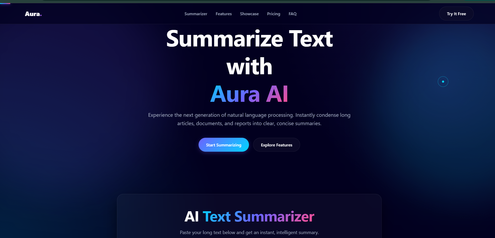
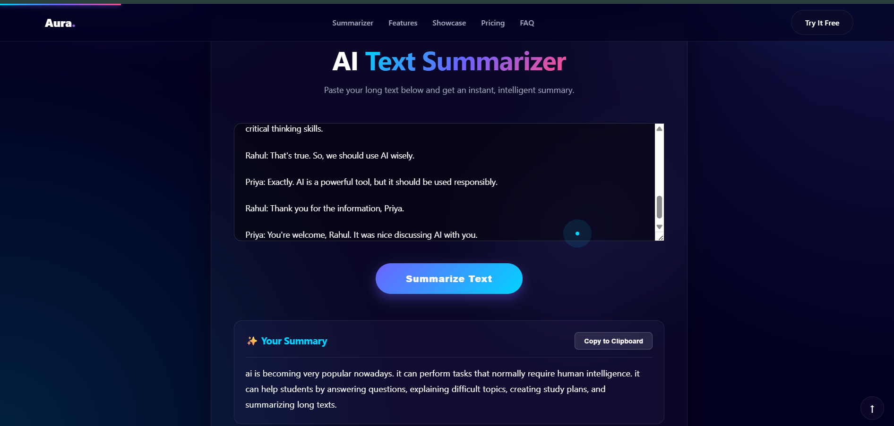

# 🧠 AI Text Summarizer

An end-to-end AI-powered text summarization web application built using **FastAPI**, **PyTorch**, and **Hugging Face Transformers**. This project leverages a fine-tuned **T5 (Text-To-Text Transfer Transformer)** model to generate concise, coherent, and contextually meaningful summaries from lengthy conversations and text passages.

Whether you're working with meeting transcripts, customer support conversations, discussion threads, or long-form text, this application helps extract key information quickly and efficiently.

---

## 🌟 Project Highlights

✨ Fine-tuned T5 Transformer model for abstractive summarization

⚡ FastAPI-powered backend with REST API support

🎨 Responsive and user-friendly web interface

🤖 Real-time AI summary generation

📡 Automatic API documentation via Swagger UI

🔄 End-to-end frontend and backend integration

📚 Built using modern NLP and Machine Learning workflows

---

## 🖼️ Project Preview

The application provides a simple and intuitive workflow:

1. Paste a long conversation or text passage
2. Click the **Summarize** button
3. Receive an AI-generated summary within seconds

### 🏠 Application Interface



### ✨ Summary Generation



---

## 🛠️ Technology Stack

### Backend

* ⚡ FastAPI
* 🤗 Hugging Face Transformers
* 🔥 PyTorch
* 🐍 Python
* 📝 Pydantic

### Frontend

* HTML5
* CSS3
* JavaScript

### AI & NLP

* T5 Transformer Model
* SentencePiece Tokenization
* Dialogue Summarization

---

## 📂 Project Structure

```text
text-summarizer/
│
├── app.py
├── requirements.txt
├── README.md
├── .gitignore
├── index.html
│
├── saved_summarizer_model/
│
└── screenshots/
    ├── homepage.png
    ├── summary-output.png
    └── swagger-docs.png
```

---

## 🚀 Getting Started

### 1️⃣ Clone the Repository

```bash
git clone https://github.com/YOUR_USERNAME/text-summarizer.git

cd text-summarizer
```

### 2️⃣ Create a Virtual Environment

```bash
python -m venv venv
```

#### Windows

```bash
venv\Scripts\activate
```

#### Linux / macOS

```bash
source venv/bin/activate
```

### 3️⃣ Install Dependencies

```bash
pip install -r requirements.txt
```

### 4️⃣ Run the Application

```bash
python -m uvicorn app:app --reload
```

Once the server starts successfully, open:

```text
http://127.0.0.1:8000
```

---

## 📡 API Endpoint

### Generate Summary

**POST** `/summarize/`

### Request

```json
{
  "Dialogue": "Your conversation or text here..."
}
```

### Response

```json
{
  "summary": "Generated summary text..."
}
```

### Interactive API Documentation

FastAPI automatically generates API documentation:

```text
http://127.0.0.1:8000/docs
```

---

## 🎯 Example

### Input

```text
John and Sarah discussed the upcoming project deadline.
John will handle the frontend implementation while Sarah
will work on the backend APIs. They agreed to finish
their tasks before Friday.
```

### Generated Summary

```text
John and Sarah planned their project work, assigning
frontend development to John and backend development
to Sarah, with a deadline set for Friday.
```

---

## 📚 What I Learned

This project provided practical experience in:

* Building scalable APIs using FastAPI
* Fine-tuning and deploying Transformer-based NLP models
* Working with Hugging Face Transformers
* Integrating machine learning models into web applications
* Managing model inference workflows
* Frontend and backend communication using REST APIs
* Debugging and troubleshooting production-like environments
* Structuring end-to-end AI applications

---

## 🔮 Future Improvements

* 📄 PDF and document summarization
* 📁 File upload support
* 🌙 Dark/Light mode toggle
* 👤 User authentication
* 🐳 Docker containerization
* ☁️ Cloud deployment (Render, Railway, AWS)
* 📜 Summary history tracking
* 🎚️ Adjustable summary lengths
* 🌍 Multi-language support

---

## 📝 Development Notes

This project combines machine learning, backend development, and frontend integration into a complete AI application. AI-assisted development tools were used during parts of the UI prototyping process to accelerate development. The model integration, FastAPI backend implementation, API design, debugging, testing, and deployment workflow were implemented and customized as part of the development process.

---

## 🤝 Contributing

Contributions, suggestions, and feedback are welcome.

If you have ideas for improvements or additional features, feel free to open an issue or submit a pull request.

---

## ⭐ Support

If you found this project useful, consider giving it a star ⭐ on GitHub.

Your support helps encourage the development of more open-source AI projects.

---

## 👨‍💻 Author

Developed with ❤️ using FastAPI, PyTorch, Transformers, and modern NLP techniques.

Happy Coding! 🚀
